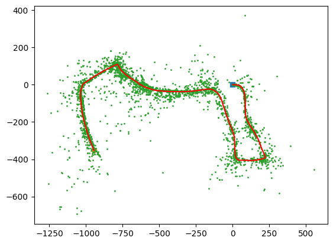

# Visual-Inertial SLAM using Extended Kalman Filter (EKF)
## Overview

This repository contains the implementation of a visual-inertial simultaneous localization and mapping (SLAM) algorithm using an Extended Kalman Filter (EKF). The algorithm leverages synchronized data from an inertial measurement unit (IMU) and a stereo camera to estimate the trajectory of the IMU and map the static landmarks in the environment. Check Project PDF for thorough explanation and results. 
## Features

    IMU Localization: Estimates the pose of the IMU over time using EKF prediction based on the SE(3) kinematics equations and IMU measurements.

    Landmark Mapping: Estimates the locations of landmarks observed in images using EKF update steps, keeping track of mean and covariance of landmark positions.

    Visual-Inertial SLAM: Combines IMU prediction with landmark mapping to achieve a complete visual-inertial SLAM algorithm.

## Sample Output

## Dependencies

    numpy
    scipy

## Data 

    Data not included but shape description can be found in project pdf 

# Install dependencies:

     pip install -r requirements.txt

## Usage

    Data Preparation:
        Ensure your dataset is structured as described in the project report.
        Modify the load_data function in pr3_utils.py to load your dataset appropriately.

    Run the Code:
        Execute the main script: python main.py.
        Adjust dataset selection and other parameters as needed within the script.

## Project Structure

    main.py: Main script to run the visual-inertial SLAM algorithm.
    pr3_utils.py: Utility functions for loading data and implementing EKF.

    README.md: Project documentation.
    ../data/: Directory containing datasets.
    
